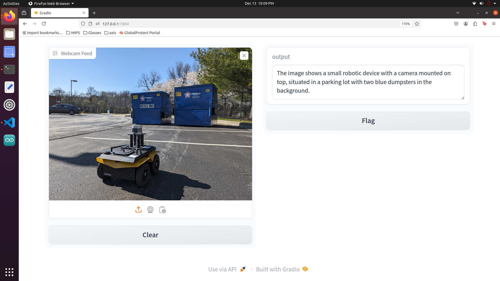

# MEMLOG - Multisensory Life Logging with AI-Powered Insights

## Enhancing Memory, Behavior Tracking, and Cognitive Support Through Wearable Technology ✨

---

### Project Idea 💡
MEMLOG is an innovative system designed to bridge memory gaps and support cognitive challenges by leveraging cutting-edge multimodal AI models. By integrating Vision-Language Models (VLMs) for real-time image captioning, speech-to-text transcription through lightweight audio models, and motion sensing, MEMLOG captures and processes multisensory inputs to create structured, text-based logs. 

The current implementation uses a Raspberry Pi connected to an Arducam for video capture and a microphone for audio processing. Data from these inputs are sent to a server hosting VLMs and audio models (e.g., Vosk) for real-time conversion into concise text summaries. These summaries are stored in a continuously updated CSV, enabling systematic event logging. The approach is privacy-centric, storing no raw data, ensuring ethical handling of personal information. 🔒

MEMLOG seeks to validate whether VLMs, LLMs, and audio models can collaborate seamlessly for real-time event capture and conversion, laying the foundation for advanced cognitive aid systems. 🚀🌟

---

### Vision and Impact 🌟

#### **Vision**:
1. **Real-Time Cognitive Aid**: Leverage AI to assist individuals in capturing, processing, and recalling significant events. 🧠
2. **Multimodal Integration**: Validate the efficiency of combining VLMs, LLMs, and audio models for real-time memory logging. 🎙
3. **Privacy-First Innovation**: Create a solution that emphasizes ethical data handling by avoiding raw data storage. 🔐

#### **Impact**:
1. **Enhanced Memory Recall**: Provides a scalable framework for individuals with cognitive challenges, such as Alzheimer's or dementia, ensuring autonomy and dignity.
2. **Behavioral Insights**: Supports habit tracking and productivity by logging actionable insights from daily interactions. 📊
3. **Technology Validation**: Establishes the feasibility of lightweight, low-power devices (e.g., Raspberry Pi) for running complex multimodal tasks in real-time. ⚙️
4. **Accessible and Scalable Design**: Sets a precedent for deploying cost-effective, edge-based solutions in wearable and IoT applications. 🌍
5. **Ethical AI**: Demonstrates how AI can respect user privacy without compromising functionality or efficiency. ✨

---


## Setup Website for MEMLOG 🌐

[**Visit MEMLOG on GitHub Pages**](https://www.google.com)

---

## Hardware Specifications

### **Edge Device - Raspberry Pi 5**
- **Device**: Raspberry Pi 5
- **Features**:
  - Quad-core Cortex-A76 processor.
  - Available in 4GB or 8GB LPDDR4x RAM variants.
  - Gigabit Ethernet ensures stable and high-speed connectivity for real-time streaming.
  - Efficient power consumption (~5W), ideal for extended deployments.
- **Role**:
  - Acts as the primary processing unit for data capture and handling.
  - Performs real-time audio transcription using locally installed software.
  - Streams video and processed audio data to the server for advanced processing.

### **Camera**
- **Model**: Arducam 16MP Autofocus Camera
- **Resolution**: 16 Megapixels, providing high-quality video and image frames.
- **Interface**: Connected via the CSI (Camera Serial Interface) port for fast and direct streaming.
- **Features**: Autofocus ensures clear capture of dynamic scenes.
- **Role**:
  - Captures live video feeds and streams the data to the server.
  - Provides frames for real-time processing by Vision-Language Models (VLMs).

### **Microphone**
- **Model**: USB Microphone
- **Features**:
  - Omnidirectional pickup pattern for comprehensive sound capture.
  - Built-in noise reduction for minimizing background interference.
  - Plug-and-play compatibility with USB interface.
- **Role**:
  - Captures real-time audio streams with minimal distortion.
  - Ensures high-quality audio input for transcription by the speech-to-text engine.

### **Server**
- **Hardware**: NVIDIA RTX 3060 GPU
- **Features**:
  - 6GB GDDR6 memory, optimized for AI/ML workloads.
  - High throughput for efficient processing of Vision-Language Models (VLMs).
- **Role**:
  - Handles computationally intensive tasks, such as image captioning with Moondream 2.
  - Processes and integrates data streams from the Raspberry Pi in real-time.

---

## Pipeline Visualization


---


## Software and Models 🖥️🎥🎧

### **Audio Processing**
- **Software**: Vosk (Offline Speech-to-Text Engine)
- **Features**:
  - Lightweight, designed for edge devices.
  - Supports multiple languages with highly accurate transcription.
  - Operates entirely offline, ensuring user privacy and low latency.
- **Processing**:
  - Converts real-time audio streams into structured text transcriptions.
  - Transcription speed: <100ms per audio segment.
- **Output**:
  - Provides timestamped text logs synchronized with video captions.

Lets compare one of the best Vosk Models for our usecase

| Model                              | Size   | Accuracy (%) | RAM Usage (MB) | Inference Time (ms) | Notes                                                                 |
|------------------------------------|--------|--------------|----------------|---------------------|----------------------------------------------------------------------|
| vosk-model-small-en-us-0.15        | 40 MB  | 85%          | 90             | 50                  | Best lightweight model for Raspberry Pi, optimized for real-time processing. |
| vosk-model-en-us-0.22              | 1.8 GB | 93%          | 800            | 350                 | High accuracy but resource-intensive; unsuitable for Raspberry Pi.   |
| vosk-model-en-us-0.22-lgraph       | 128 MB | 88%          | 200            | 120                 | Moderate accuracy and resource usage; balanced choice for small devices. |
| vosk-model-en-us-0.42-gigaspeech   | 2.3 GB | 94%          | 1200           | 400                 | Excellent for podcasts but not suitable for low-power devices.       |
| vosk-model-en-in-0.5               | 1 GB   | 75%          | 600            | 300                 | Generic Indian English model; accurate for broadcast and telecom data. |
| vosk-model-small-en-in-0.4         | 36 MB  | 70%          | 85             | 55                  | Lightweight Indian English model for mobile or low-power applications. |


#### Download Instructions for Vosk Model

To download the **vosk-model-small-en-us-0.15**:

1. Visit the official Vosk models page: [Vosk Models](https://alphacephei.com/vosk/models).
2. Locate **"vosk-model-small-en-us-0.15"** and click the download link.

This model is lightweight and optimized for real-time speech-to-text processing on devices like Raspberry Pi! 🖥️✨


---

### **Video Processing**

Vision-Language Models are essential because they bridge the gap between visual and textual data, enabling deeper context understanding. Unlike traditional image captioning models, VLMs integrate reasoning and multimodal learning, offering richer, more accurate descriptions. 🌟

Here we compare the best models out there which may work with the configurations well.


| Model          | Parameters | Performance                     | Resource Efficiency               | Processing Rate     | Use Case                                                                 |
|----------------|------------|---------------------------------|------------------------------------|---------------------|---------------------------------------------------------------------------|
| Moondream 2    | 1.86B      | Lightweight, basic reasoning    | Efficient for mid-range GPUs (e.g., RTX 3060) | 1 frame/second      | Ideal for edge-to-cloud image captioning with minimal resource consumption. |
| LLaVA          | 13B        | Complex reasoning, high accuracy | Higher resource requirements       | ~0.5 frames/second  | Best for advanced image captioning and vision-language reasoning but resource-heavy. |
| MiniGPT-4      | 4B         | Balanced efficiency and performance | Moderate resource needs            | ~1 frame/second     | Suitable for tasks requiring a balance between processing speed and resource consumption. |
| BLIP-2         | 12B        | High accuracy for image QA      | Moderately resource-intensive      | ~0.8 frames/second  | Excels at vision-language tasks requiring accurate image-caption alignment. |
| CLIP (OpenAI)  | 400M       | Moderate accuracy, fast embedding | Extremely lightweight              | ~2 frames/second    | Effective for basic multimodal tasks like visual embedding generation in real-time. |
| Florence       | 5B         | High performance, context-aware | Moderate to high resource demands  | ~0.7 frames/second  | Designed for sophisticated vision-language tasks, including video summarization. |

- **Model**: Moondream 2 (Vision-Language Model)

- **Features**:
  - Moondream 2 provides a perfect balance of lightweight processing and basic reasoning capabilities, making it ideal for real-time operations on mid-range GPUs.
  - Lightweight and efficient, designed for edge-to-cloud operations.
  - Optimized for real-time image captioning.
  - Its minimal resource consumption ensures cost-effective deployment for edge-to-cloud systems. 🚀
- **Processing**:
  - Processes video frames received from the Raspberry Pi at a rate of one frame per second.
  - Generates descriptive captions, including objects and scene details, for each frame.
- **Output**:
  - Timestamped textual descriptions that are aligned with audio transcriptions.


### **Data Synchronization and Storage**
- **CSV Logging System**:
  - **Format**:
    - Timestamp: Accurate to the second, ensuring precise synchronization between audio and video data.
    - Image Caption: Text description of scenes and objects generated by Moondream 2.
    - Audio Transcription: Text logs produced by Vosk from live audio streams.
  - **Role**:
    - Logs are updated in real-time as new data is processed.
    - Lightweight format ensures minimal storage requirements while maintaining high usability.
  - **Output**:
    - Serves as a consolidated repository for multimodal data, enabling future analysis or retrieval, below is the example output of CSV


---

### **Key Technical Models and Specifications**
- **Vosk (Speech-to-Text)**:
  - Offline transcription for privacy-preserving audio processing.
  - Operates seamlessly on Raspberry Pi 5 without requiring internet connectivity.
- **Moondream 2 (Vision-Language Model)**:
  - Hosted on a GPU-accelerated server.
  - Optimized for low-latency image captioning tasks.
  - Processes visual data into textual summaries, essential for multimodal integration.

---


# Setup and Instructions for Both Server and Raspberry Pi

Below is a step-by-step guide to set up and run the server and Raspberry Pi components for your project. The setup includes creating the required virtual environments, installing dependencies, configuring the environment, and running the scripts.

---

## 1. Prerequisites

### Server and Raspberry Pi
- Ensure Python 3.8+ is installed.
- Install pip and virtualenv:
  ```bash
  sudo apt update
  sudo apt install python3-pip
  pip install virtualenv
  ```

### Networking
- Ensure both devices are on the same network.
- Note the IP address of the server:
  ```bash
  hostname -I | awk '{print $1}'
  ```
- Replace `192.168.1.42` in all scripts with the server's IP address.

### Camera Access (Raspberry Pi Only)
- Ensure the camera module is enabled on Raspberry Pi:
  ```bash
  sudo raspi-config
  ```
  Navigate to `Interface Options > Camera` and enable it.

---

## 2. Directory Structure

Your project should have the following directory structure:

```
project/
├── rpi
│   ├── Code
│   │   ├── audio.py
│   │   ├── cam_stream.py
│   │   ├── requirements_rpi.txt
│   │   └── verify_rpi.py
└── server
    ├── Code
    │   ├── requirements_server.txt
    │   ├── socket_server.py
    │   └── verify_server.py
    ├── Output
    │   └── captions_output.csv
```

---

## 3. Server Setup

### Create and Activate Virtual Environment
```bash
cd project/server/Code
python3 -m venv glasses
source glasses/bin/activate
```

### Install Dependencies
- Install the dependencies from `requirements_server.txt`:
  ```bash
  pip install -r requirements_server.txt
  ```

**Contents of requirements_server.txt:**
```
torch
transformers
Pillow
numpy
opencv-python
pygobject
pycairo
gstreamer1.0
gstreamer1.0-plugins-base
gstreamer1.0-plugins-good
gstreamer1.0-plugins-bad
gstreamer1.0-plugins-ugly
gstreamer1.0-libav
gstreamer1.0-tools
```

### Install GStreamer
```bash
sudo apt update
sudo apt install -y gstreamer1.0* libgirepository1.0-dev
```

### Verify Setup
Run the `verify_server.py` script:
```bash
python verify_server.py
```

**Contents of verify_server.py:**
```python
import torch
import cv2
import gi
gi.require_version('Gst', '1.0')
from gi.repository import Gst

print(f"Torch version: {torch.__version__}")
assert torch.cuda.is_available(), "CUDA not available. Check GPU setup."

print(f"OpenCV version: {cv2.__version__}")

Gst.init(None)
print("GStreamer initialized successfully.")
```

---

## 4. Raspberry Pi Setup

### Create and Activate Virtual Environment
```bash
cd project/rpi/Code
python3 -m venv glasses
source glasses/bin/activate
```

### Install Dependencies
- Install the dependencies from `requirements_rpi.txt`:
  ```bash
  pip install -r requirements_rpi.txt
  ```

**Contents of requirements_rpi.txt:**
```
vosk
sounddevice
numpy
jsonschema
gstreamer1.0
gstreamer1.0-plugins-base
gstreamer1.0-plugins-good
gstreamer1.0-plugins-bad
gstreamer1.0-plugins-ugly
gstreamer1.0-libav
gstreamer1.0-tools
```

### Install GStreamer
```bash
sudo apt update
sudo apt install -y gstreamer1.0* libgirepository1.0-dev
```

### Verify Setup
Run the `verify_rpi.py` script:
```bash
python verify_rpi.py
```

**Contents of verify_rpi.py:**
```python
import sounddevice as sd
import vosk
import gi
gi.require_version('Gst', '1.0')
from gi.repository import Gst

print(f"Vosk version: {vosk.__version__}")
print(f"Available audio devices: {sd.query_devices()}")

Gst.init(None)
print("GStreamer initialized successfully.")
```

### Download and Set Up Vosk Model
- Download the Vosk model (e.g., `vosk-model-small-en-us-0.15`) and place it in `project/rpi/Code/model/us_eng/`.
- Extract the model:
  ```bash
  mkdir -p model/us_eng
  mv path/to/downloaded/model.tar.gz model/us_eng
  cd model/us_eng
  tar -xvf model.tar.gz
  rm model.tar.gz
  ```

---


## 5. Testing Moondream Model on Gradio

This section demonstrates testing the **Moondream 2** model using a simple Gradio interface for real-time image captioning from webcam input. The script `moondream.py` is located in:
`server/code/extras/moondream.py`

---

### Steps to Test the Gradio Interface 🚀

1. **Navigate to the extras directory:**
   ```bash
   cd server/code/extras
   ```

2. **Run the `moondream.py` script:**
   ```bash
   python moondream.py
   ```

3. **Access the Gradio Interface:**
   - Once the script is running, Gradio will provide a local URL, such as:
     ```
     Running on local URL:  http://127.0.0.1:7860
     ```
   - Open this URL in your browser to view the interface. 🌐

---

### Interface Example 


#### **Webcam Input and Captions**

- **Caption generated by the model:**



---

### Functionality ✨

The Gradio interface allows you to:
- **Input:** An image frame (webcam feed or uploaded file).
- **Output:** Receive a textual description generated by the Moondream 2 model.

---

### Features 🌟
- Real-time processing of webcam feed.
- Descriptive captions with detected objects and scenes.
- Interactive testing for validating the model's functionality.

---


## 6. Running the System

### Step 1: Start the Server
On the server, navigate to the server code directory, activate the virtual environment, and run `socket_server.py`:
```bash
cd project/server/Code
source glasses/bin/activate
python socket_server.py
```


### Step 2: Start Camera Stream on Raspberry Pi
On the Raspberry Pi, navigate to the RPi code directory, activate the virtual environment, and run `cam_stream.py`:
```bash
cd project/rpi/Code
source glasses/bin/activate
python cam_stream.py
```


### Step 3: Start Audio Transcription on Raspberry Pi
On the Raspberry Pi, run `audio.py` in the same directory:
```bash
python audio.py
```


---

## 7. Important Changes Before Running

### Replace IP Address
Replace `192.168.1.42` in `cam_stream.py` and `audio.py` with the actual IP of the server:
- Find the server's IP:
  ```bash
  hostname -I | awk '{print $1}'
  ```
- Ensure both devices are on the same network.

### Verify Port Numbers
- Ensure the correct port numbers:
  - **5000** for video stream.
  - **5001** for audio transcription.

---


### **Challenges Faced**

1. **High Resource Requirements**: Real-time summarization using Vision-Language Models (VLMs) and audio transcription models required significant computational resources, limiting on-device processing capabilities.
2. **Privacy Concerns**: Server-side processing introduced potential privacy risks as sensitive data had to be transmitted over the network.
3. **Latency in LLMs**: Larger Language Models (LLMs) like Mistral and BTLM-3B-8K demonstrated superior reasoning capabilities but caused delays due to their high computational demand, making them unsuitable for real-time applications.
4. **Heat Management**: Continuous processing on the Raspberry Pi led to overheating, impacting performance during extended operations.
5. **Synchronization Challenges**: Aligning audio transcriptions with visual data in real-time required precise timestamping and robust synchronization techniques.

---

### **Future Work**

1. **ESP32-Based Smart Glasses**: Transitioning to ESP32 for lightweight, battery-efficient smart glasses will enable greater portability and reduce dependence on Raspberry Pi.
2. **Adaptive Learning with LLMs**: Incorporate adaptive learning mechanisms using optimized lightweight LLMs to dynamically adjust to evolving user contexts and improve real-time accuracy.
3. **On-Device LLM Deployment**: Develop highly efficient, edge-compatible LLMs to minimize server reliance, ensuring real-time summarization with enhanced privacy.
4. **Augmented Reality (AR) Interfaces**: Explore AR smart glasses to deliver immersive visual feedback and enable direct user interactions with summarized data.
5. **Energy-Efficient Models**: Integrate hardware accelerators like Google Coral TPU to address computational bottlenecks and improve processing efficiency.
6. **Enhanced Privacy Safeguards**: Develop on-device encryption techniques to handle sensitive data and ensure complete confidentiality without compromising performance.

---


### Contributing ✨

If you'd like to contribute to MEMLOG, please read through our **Contributing Guide**, which outlines the philosophies to preserve, tests to run, and much more. We highly recommend reviewing this guide before writing any code to ensure alignment with the project's goals and standards. 📜

The Contributing Guide also highlights prospective features and areas that could use attention. For a more detailed overview of MEMLOG's direction and objectives, be sure to check out the **Product Roadmap**. 🚀

Thanks in advance for any and all contributions to MEMLOG! 🙌

---

### Support 💬

If you encounter an issue or require technical assistance, please first review the closed and open **GitHub Issues**, as they may contain solutions or valuable advice. 🔍

If you're still having trouble, feel free to create a new issue on GitHub, describing the problem in detail, including steps you've taken to debug it.

For further assistance, please contact our support team at **support@memlog.com**. 📧

---

### Contact 📪

MEMLOG's core developer is Snehalraj Chugh and my Mentor is Masoud Soroush. You can reach me via email:
- **Snehalraj Chugh**: schugh1@umbc.edu

For technical support and other problems, please go through the channels mentioned above to ensure timely assistance. 💡

For a complete list of contributors, please see **AUTHORS.md**. 📝

---

### License 📜

Copyright (c) 2024, Snehalraj Chugh. All rights reserved.

MEMLOG is covered by the **MIT license**, a permissive free software license that allows you to do anything you want with the source code, provided you give proper attribution and "don't hold [us] liable." For the full license text, see the **LICENSE.md** file. 🛡️


